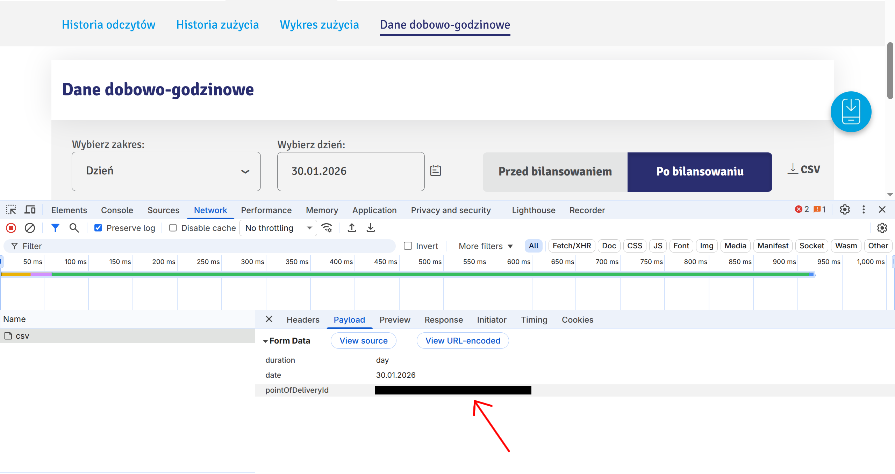

# Enea Client

A standalone Python script for downloading hourly energy consumption data from the Enea customer portal (ebok.enea.pl). This tool automates the process of logging into the Enea portal, retrieving hourly energy consumption data for a given month in CSV format, and optionally running post-processing scripts (which can be used later, for example, to import data into Home Assistant or other systems).

## Requirements

- Python 3.8 or higher, no external packages needed - only standard library modules are used.
- Valid Enea ebok customer account credentials and an energy meter that supports real-time data reporting (check if you have data available at https://ebok.enea.pl/meter/summaryBalancingChart).

## Usage

### Basic Usage

Download specific months in CSV format. Files are sanitized and saved to the specified output directory. Optionally, a post-processing script can be specified.

```bash
python -m enea_client \
    --enea-login your-email@example.com \
    --enea-password your-password \
    --enea-pod-guid your-pod-guid \
    --output-dir ./energy_data \
    --dates 12.2025,01.2026 \
    --post-process-script ./process_data.sh \
    --verbose
```

Where command line arguments are:

- `--enea-login`: Your Enea portal email
- `--enea-password`: Your Enea portal password
- `--enea-pod-guid`: Your Point of Delivery GUID (found in your Enea account). See "Finding Your POD GUID" section below
- `--output-dir`: Directory to save downloaded CSV files
- `--dates`: Comma-separated list of months to download (format: MM.YYYY)
- `--post-process-script`: (Optional) Path to a script that will be executed after download completes, receiving paths to all generated CSV files as arguments
- `--verbose`: (Optional) Enable verbose logging for debugging purposes

### Finding Your POD GUID

This example uses the Chrome browser:

1. Log into your Enea customer portal and navigate to https://ebok.enea.pl/meter/summaryBalancingChart.
2. Open browser developer tools and go to the Network tab.
3. Choose a day with available data and click to download CSV data.
4. The `pointOfDeliveryId` parameter in the request URL is your POD GUID (see screenshot below).

[](docs/pod_guid_screenshot.png)

### Output Format

The script saves data for each specified month in a separate CSV file in the output directory. An example output file for January 2026 would look like this:

    Data;"Wolumen energii elektrycznej pobranej z sieci przed bilansowaniem godzinowym";"Wolumen energii elektrycznej oddanej do sieci przed bilansowaniem godzinowym";"Wolumen energii elektrycznej pobranej z sieci po bilansowaniu godzinowym";"Wolumen energii elektrycznej oddanej do sieci po bilansowaniu godzinowym"
    "2026-01-01 00:59";"0.123";"0";"0.123";"0"
    "2026-01-01 01:59";"0.124";"0";"0.124";"0"

### Post-processing Scripts

If you specify a `--post-process-script`, it will be executed after all data has been downloaded. The script receives the paths of all generated CSV files as command-line arguments.

See example post-processing script `post_process_script.sh` in the `scripts/` directory for reference.

### Security Considerations

Consider using environment variables instead of command-line arguments for sensitive data. See .env.example for reference and advanced usage tab below.

## Advanced Usage

Download data automatically every day, then process the data with custom scripts and import it into your Home Assistant energy tab.

1. Configure custom Home Assistant sensors for export and import energy data. Since data is available with a few days' delay, a custom integration is needed to import data. See [Home Assistant Statistics Integration](https://github.com/klausj1/homeassistant-statistics) for details. Example:

    a. Create template sensors in your `configuration.yaml`:

    ```yaml
    template:
        - sensor:
            - name: Grid import energy
             unique_id: grid_import_energy
             state: 0
             unit_of_measurement: "kWh"
             device_class: energy
             state_class: total_increasing

            - name: Grid export energy
             unique_id: grid_export_energy
             state: 0
             unit_of_measurement: "kWh"
             device_class: energy
             state_class: total_increasing
    ```

    b. Import one point with value 0 for each sensor to initialize it. The date should be the start of the statistics period. All future data will append to this initial value.

2. Create a post-processing script that processes the downloaded CSV files and imports them into your home assistant or other systems. See `scripts/post_process_script.sh` for an example.
3. Create a systemd service and timer to run the script monthly. See `scripts/enea_client.service` and `scripts/enea_client.timer` for examples.

## Development

Install with test dependencies:

```bash
pip install -e .[test]
```

Run tests with coverage:

```bash
coverage run -m pytest -v
```

## Caveats

The purpose of this tool is to provide a simple way to download energy consumption data from the Enea portal and integrate it into other systems. It is not an official Enea product and is not affiliated with Enea in any way. Use at your own risk.

## Contributing

This is a standalone tool with no external dependencies. Contributions are welcome!
